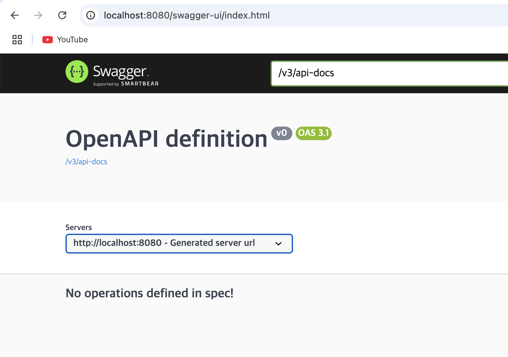
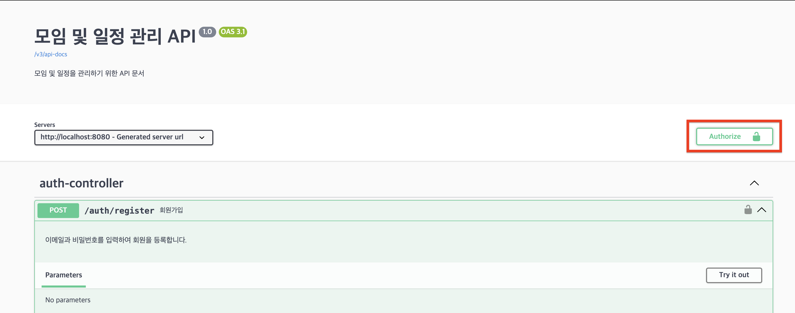
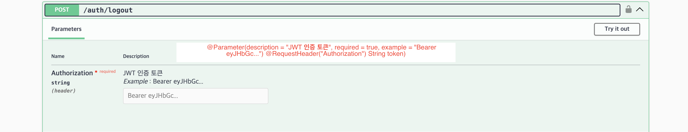

# swagger

reset api 를 문서화 하여 호출, 테스트 할 수 있도록 합니다.

## getting started

### db

```bash
$ docker-compose up -d
```

### url 접근

[http://localhost:8080/swagger-ui/index.html](http://localhost:8080/swagger-ui/index.html)



#### 인증

```java
@OpenAPIDefinition(
    info = @Info(title = "모임 및 일정 관리 API", version = "1.0", description = "모임 및 일정을 관리하기 위한 API 문서"),
    security = @SecurityRequirement(name = "bearerAuth") // security 작성
)
@SecurityScheme(name = "bearerAuth", type = SecuritySchemeType.HTTP, scheme = "bearer", bearerFormat = "JWT");
```

아래와 같이 authorize 버튼이 새성



#### parameter

